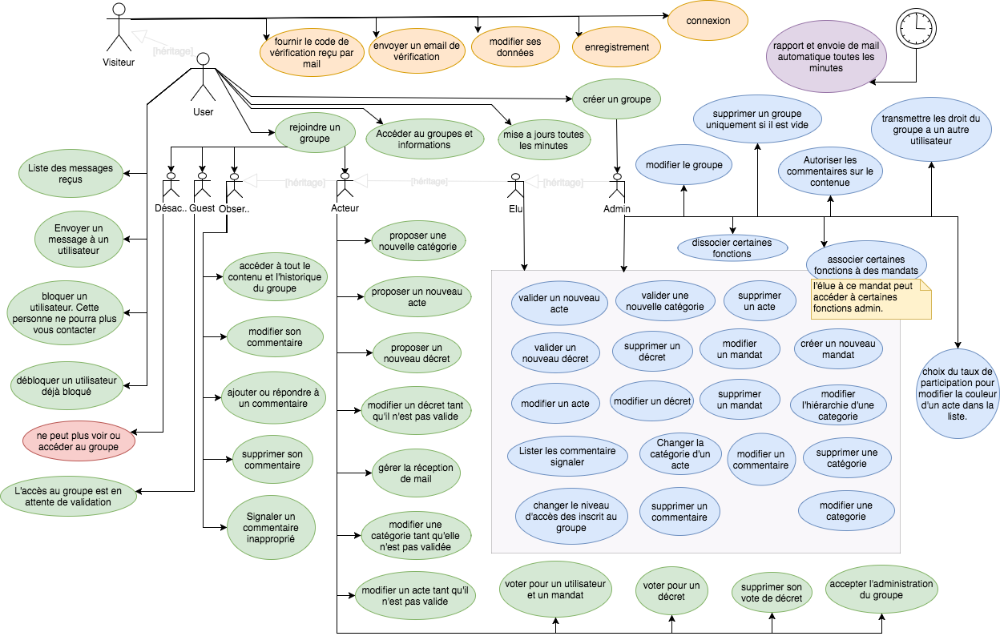
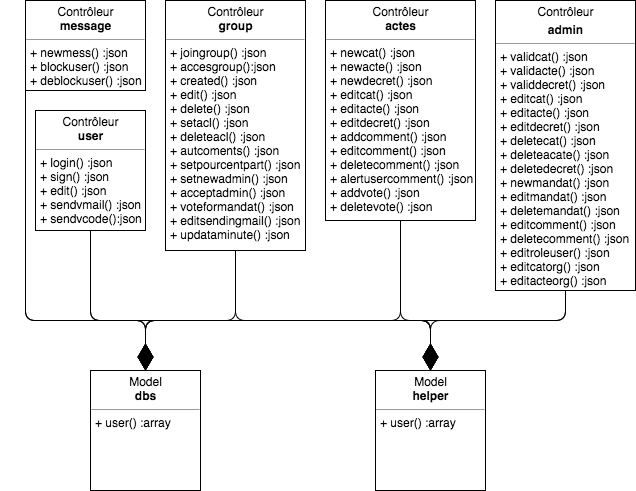
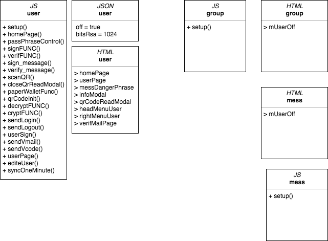

# Spécification fonctionnelle & technique (V.2)

**Application web APSO V.2**

> Ce document comporte l’ensemble des règles de fonctionnement et de l'architecture de votre application.

***

## I Introduction

**La plateforme APSO est l’outil pour organiser une élection, créer un sondage ou un vote en ligne.**



Application qui permet de créer des groupes - lesquels groupes centrés sur une fonction principale de scrutin ; qui permet de créer et voter des lois ainsiq qu'élire à des postes ou "mandats". Les Citoyens sont législateurs, créateurs et votant et tous sont susceptibles d'être élus à des postes/mandats. Ce scrutin (ou ce sondage) est recalculé en permanence et à chaque moment chaque résultat peut basculer ; les citoyens sont avertis pour un effet immédiat. Le procédé est intitulé Démocratie Flux Direct.

***

## II Api

> Api dédiée en PHP avec le protocole JSON RPC 2.



### Class user

* **login($a, $t, $s)**
	
	> Connexion de l'utilisateur.
	
	| param | Type | Desc |
	|-------|------|------|
	| $a | string | Identifiant client (adresse bitcoin). |
	| $t | int | Timestamp actuel. |
	| $s | string | Signiature (hash sha1 Timestamp+Identifiant). |
	
	*Return*
	
	```js
	{
		'guest' : 1, // L'utilisateur n'est pas encore enregistré.
		'valide' : 1, // L'utilisateur n'a pas encore valider ou modifier sont mail.
		'info' : { // Variable $user or 0
			'addr' : // Identifiant client (adresse bitcoin).
			'nom' : // Le nom du client.
			'prenom' : // Le prénom du client.
			'mail' : // Le mail du client.
			'inscdate' : // La date d'inscription.
		},
		'admin' : [
			{'addcat' : 1}
			{'deletecat' : 1}
			{'editcat' : 1}
			{…}
		]
		'log' : {
			'nb' : // Le nombre d'actions dans le log.
			'list' : [
				[0] : {
					'id_user' : // L'identifiant unique crée par l'application.
					'nom' : // Le nom de l'utilisateur.
					'prenom' : // Le prénom de l'utilisateur.
					'action' : // L'action de l'historique.
					'date' : // La date de l'action.
					'msg' : // Le message de l'action.
				} [1] //...
			]
		}
	}
	```
	
* sign()
* edit()
* sendvmail()
* getvcode()

### Class message
* newmess()
* blockuser()
* deblockuser()

### Class group
* joingroup()
* accesgroup()
* created()
* edit()
* delete()
* setacl()
* deleteacl()
* autcoments()
* setpourcentpart()
* setnewadmin()
* acceptadmin()
* voteformandat()
* editsendingmail()
* updataminute()

### Class actes
* newcat()
* newacte()
* newdecret()
* editcat()
* editacte()
* editdecret()
* addcomment()
* editcomment()
* deletecomment()
* alertusercomment()
* addvote()
* deletevote()

### Class admin
* validcat()
* validacte()
* validdecret()
* editcat()
* editacte()
* editdecret()
* deletecat()
* deleteacate()
* deletedecret()
* newmandat()
* editmandat()
* deletemandat()
* editcomment()
* deletecomment()
* editroleuser()
* editcatorg()
* editacteorg()

***

## III Base de données

> Les fonctions du modèle et l'architecture de la base de données.


***


## IV Application web

> La partie graphique en HTML CSS et JS.



### Object user
* **setup()**
* homePage()
* passPhraseControl()
* signFUNC()
* verifFUNC()
* sign_message()
* verify_message()
* scanQR()
* closeQrReadModal()
* paperWalletFunc()
* qrCodeInit()
* decryptFUNC()
* cryptFUNC()
* sendLogin()
* sendLogout()
* userSign()
* sendVmail()
* sendVcode()
* userPage()
* editeUser()
* syncOneMinute()

***

## III Utilisateur

L'utilisateur entre, côté client une phrase secrétée qui génère une clé public, avec là qu'elle, il est identifié côté serveur. Si l'utilisateur doit faire une modification exigent son authentification, un message est signé côté client.
Si le client se connecte pour la première fois et n'est pas reconnu par l'api, Un formulaire lui demande de finaliser son inscription avec les information suivante :

* nom
* prénom
* email

Apres la verification de mail, un nouveau utilisateur est créer dans la base de données et les info de connexion son retourner.

### Fonctions et variables disponible dans le framework

> Accès au information de l'utilisateur côté jQuery, dans toutes les fonctions du framework.

#### Variables disponibles.

```js
// PassPhrase.
$.m.user.wallet.passPhrase

// Identifiant client. Address bitcoin.
$.m.user.wallet.addr

// Hash pass phrase bitcoin.
$.m.user.wallet.hash

// Private Key
$.m.user.wallet.key

// RSA object.
$.m.user.wallet.RSAkey

// RSA public key.
$.m.user.wallet.PublicKeyString
```

#### Signer un message

```js
// Init bitcoin object.
var sec = new Bitcoin.ECKey($.m.user.wallet.hash);
var key = ''+sec.getExportedPrivateKey();
var payload = Bitcoin.Base58.decode(key);
var compressed = payload.length == 38;

// Signer le message.
var sign = $.btc.sign_message(sec, 'YOUR-MESSAGE', compressed);
```

#### Decrypte message

```js
var DecryptionResult = cryptico.decrypt('MESSAGE', $.m.user.wallet.RSAkey);
```

#### Crypte message

```js
// Crypte pour un autre l'utilisateur.
var EncryptionResult = cryptico.encrypt('MESSAGE', 'clé publique du destinataire');

// Crypte pour l'utilisateur.
var EncryptionResult = cryptico.encrypt('MESSAGE', $.m.user.wallet.PublicKeyString);
```

#### Les événement déclenché par la partie utilisateur

| Event | Desc |
|-------|------|
| login | Cette événement est lancé a la connexion d'un utilisateur. |
| logout | Cette événement est lancé a la déconnexion d'un utilisateur. |

#### Ecoute des événement.

```js
$('#'+$.m.div.event).on('login', function);
$('#'+$.m.div.event).on('logout', function);
```

### Côté serveur

> Vérification de la signature électronique côté serveur par le php, dans toutes les fonctions du framework.

#### Validation de la signature

```php
// Return true or false.
valide::btc_sign($bitcoinAdresse, $message, $signature);
```

#### Couleur et logo du client

> Déterminer automatiquement la couleur a partir de l'adresse bitcoin et son contraste.


```php
// Récupérer les 3 premiers caractères après le 1.
$a = substr('ADDR_BTC', 1, 3);
$color = bin2hex($a);
```

##### Contraste

```php
$r = dechex(255 - hexdec(substr($color,0,2)));
$r = (strlen($r) > 1) ? $r : '0'.$r;
$g = dechex(255 - hexdec(substr($color,2,2)));
$g = (strlen($g) > 1) ? $g : '0'.$g;
$b = dechex(255 - hexdec(substr($color,4,2)));
$b = (strlen($b) > 1) ? $b : '0'.$b;
$contrast = $r.$g.$b;
```

##### CSS pour le logo

```css
div#couleur {
    height: 100px;
    width: 100px;  
    background-color: #$color;
    border-radius: 50%;
    font-size: 2.4em;
    text-align: center;
    line-height: 100px;
    color: #$contrast;
}
```

***

## XXII Design

Le template choisi par le client : [centaurus](http://centaurus.adbee.technology/v5/)

Shop pour l'achat : [wrapbootstrap](https://wrapbootstrap.com/theme/centaurus-WB0CX3745)


***


