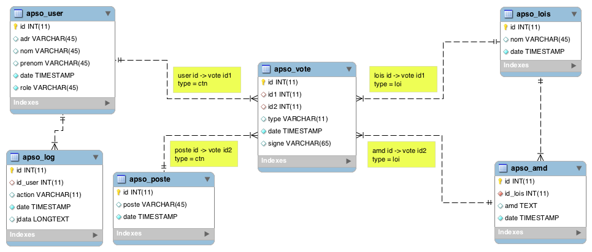

# Spécification technique (STB V.0.1)

**Application web APSO**

> Ce document comporte l’ensemble des règles, nommage des fonctions, conception de la base de données. Ça sera la feuille de route pour le développement.

***

## Connexion des utilisateurs

> Accès au information de l'utilisateur côté jQuery, dans toutes les fonctions du framework.

*Variables disponibles.*
```js
// Identifiant client. Address bitcoin.
$.m.user.wallet.adr

// Hash crypter de la phrase secrète.
$.m.user.wallet.hash
```

*Décrypte la phrase secrète*
```js
// hash passphrase.
var hash = Crypto.util.hexToBytes($.crp.decrypte($.m.user.wallet.hash, $.sha1('YOUR-CODE-PIN')));
```

*Récupérer l'adresse bitcoin et la clé privée en string*
```js
// Initialize new bitcoin object.
var sec = new Bitcoin.ECKey(hash);

// Get bitcoin adresse.
var adr = ''+sec.getBitcoinAddress();

// Get private key.
var key = ''+sec.getExportedPrivateKey();
```

*Signer un message*
```js
// Compresse private key.
var payload = Bitcoin.Base58.decode(key);
var compressed = payload.length == 38;

// Signer le message.
var sign = $.btc.sign_message(sec, 'YOUR-MESSAGE', compressed);
```
*Les événement déclenché par la partie utilisateur*

| Event | Desc |
|-------|------|
| login | Cette événement est lancé a la connexion d'un utilisateur. |
| logout | Cette événement est lancé a la déconnexion d'un utilisateur. |

#### Côté serveur

> Vérification de la signature électronique côté serveur par le php, dans toutes les fonctions du framework.

*Validation de la signature*
```php
// Return true or false.
valide::btc_sign($bitcoinAdresse, $message, $signature);
```

***

## Gestion des rôles et accées.

> L'utilisateur dispose de 5 rôles. Les rôles sont attribués par les administrateurs ou par les postes, disposant de la fonction propriétaires.

| Rôle | Code | Desc |
|------|------|------|
| guest | GUEST | Le rôle par défaut après l'inscription de l'utilisateur dans l'api. Retourne un message "En attente de validation par un administrateur." |
| banni | BANNI |Concerne les utilisateurs bannis par un administrateur ou un poste disposant de la fonction propriétaire. Regroupe aussi les visiteurs non identifiés après l'inscription. Retourne un message "Vous êtes bloqué. Veuillez contacter un administrateur." |
| obs | OBS | Le groupe des Observateur, ont seulement accès a l'historique et les résulta du suffrage. |
| citoyen |CITOYEN | Les citoyens ont le droit d'exprimer leurs votes et proposer de nouvelles lois. Ils peuvent aussi être élus. |
| admin | ADMIN | Ils gèrent et modifient toutes les données de l'api. |

#### Gestion des postes.

> les postes permet de définir des fonctions propriétaires accessibles seulement a l'utilisateur élu au poste à ce moment-là. Par défaut, 4 postes sont déja crée.

| Poste | Nom |
|-------|-----|
| 1 | Président |
| 2 | Secrétaire |
| 3 | Trésorier |
| 4 | Vice-Président |

#### Fonction propriétaire.
> Les postes peuvent être associés à des fonctions propriétaires.

| Fonction | Desc | Associés |
|----------|------|----------|
| addPoste | Ajouter un nouveaux poste dans la base de données. | Secrétaire |

***

## Gestion de l'historique

> Les actions disponibles dans l'application et leurs descriptions.

| Action | Desc | jdata |
|--------|------|-------|
| SAVE | Inscription de l'utilisateur | id user, adresse bitcoin, nom, prénom, date, rôle |

***

## Gestion des erreurs

| Code | Desc |
|-------|-----|
| ERR-NOT-FIND-FILE | Erreur lors du chargement du fichier d'exécution. |
| ERR-INVALID-PARAM-OR-METHODE | Méthodes ou Paramètres incorrects. Erreur dans les données d'accès. |
| ERR-CONNECT-MYSQL | Connexion au serveur MySQL impossible. Erreur dans les données d'accès. |
| ERR-OFFLINE-MESSAGE | L'application est actuellement indisponible pour cause de maintenance. Désolé pour le désagrément. |
| ERR-MODEL-DATABASE | Erreur lors de l'exécution de la commande de model SQL. |
| ERR-BTC-ADR-INVALID | L'adresse bitcoin ne semble pas être valide. |
| ERR-BTC-SIGN-INVALID | La signature électronique ne semble pas être valide. |
| ERR-ACCOUNT-ALREADY-EXISTS | L'utilisateur est déjà enregistré dans la base de données. |
| ERR-ECHEC-SAVE-USER | L'enregistrement de l'utilisateur a échoué. |
| ERR-NAME-OR-FIRSTNAME-INVALID | Votre nom ou prénom semble invalide. |
| ERR-POSTE-INVALID | Le poste semble invalide. |
| ERR-USER-NOT-EXISTS | Votre identifiant n'est pas reconnu. |
| ERR-TIMESTAMP-INVALID | Le timestamp semble invalide. |
| ERR-USER-NOT-ACCESS | Vous n'êtes pas autorisé à accéder à cette ressource. |

***

# ∑ Architecture

> Le projet est constitué d'une api côté serveur et d'une application web côté client. Nous commençons ici par les fonctions du modèle et la base de données.



***

## ∑ Model SQL dbUser
> Regroupe les fonctions en rapport avec la table user.

### Ω dbUser::getUserByBtc($e)
> Retourne la table de l'utilisateur trouver par son identifiant (adresse bitcoin).

**Informations entrantes**

| param | Type | Desc |
|-------|------|------|
| $e | array | Un tableau contenant l'identifiant de l'utilisateur. |

**Règles de gestion**

En cas d'erreur, lever une exception `ERR-MODEL-DATABASE`.
```php
db::go('SELECT * FROM apso_user WHERE adr=:adr');
```

**Informations sortantes**
```php
Array {
	[id] = // L'identifiant unique crée par l'application.
	[adr] = // Identifiant client (adresse bitcoin).
	[nom] = // Le nom du client.
	[prenom] = // Le prenom du client.
	[date] = // La date d'inscription.
	[role] = // Le rôle de l'utilisateur.
}
```

### Ω dbUser::setUser($e)
> Ajoute un nouvel utilisateur dans la base de données.

**Informations entrantes**

| param | Type | Desc |
|-------|------|------|
| $e | array | Un tableau contenant l'identifiant client, nom, prénom, date, rôle. |

**Règles de gestion**

En cas d'erreur, lever une exception `ERR-MODEL-DATABASE`.
```php
db::go('INSERT INTO apso_user VALUES("", :adr, :nom, :prenom, :date, :role)');
```

### Ω dbUser::setLog($e)
> Ajoute un nouvel historique dans la base de données. Retourne void.

**Informations entrantes**

| param | Type | Desc |
|-------|------|------|
| $e | array | Un tableau contenant l'id user, l'action, date, jdata. |

**Règles de gestion**

En cas d'erreur, lever une exception `ERR-MODEL-DATABASE`.
```php
db::go('INSERT INTO apso_log VALUES("", :id_user, :action, :date, :jdata)');
```

### Ω dbUser::getPrivFunc($e)
> Retourne la fonction propriétaire accompagner des postes assignés et leurs résultats de vote.

**Informations entrantes**

| param | Type | Desc |
|-------|------|------|
| $e | array | Un tableau contenant le nom de la fonction propriétaire. |

En cas d'erreur, lever une exception `ERR-MODEL-DATABASE`.
```php
db::go('SELECT f.name, p.id, v.id1, COUNT(v.id2) nb,
	FROM apso_func f 
	RIGHT JOIN apso_poste p 
	ON f.id_poste = p.id 
	INNER JOIN apso_vote v 
	ON p.id = v.id2 AND v.type = "ctn"
	WHERE f.name=:name 
	GROUP BY v.id1 
	ORDER BY p.id ASC, nb DESC');
```

**Informations sortantes**

```php
Array [
	[0] = Array [
		[name] = // Le nom de la fonction propriétaire. NULL MULTI
		[id] = // Identifiant du poste associé. MULTI
		[id1] = // Identifiant du client élu.
		[nb] = // Nombre de voix obtenues.
	]
	[1] = // ...
]
```

***

## ∑ HELPER
> Regroupe les fonctions réutilisable dans tous les contrôleurs et actions.

### Ω help::user($a, $v, $s)
> Vérification de l'adresse bitcoin, de la signature du client. Recherche du client dans la base de données. Retourne les infos du client.

**Informations entrantes**

| param | Type | Desc |
|-------|------|------|
| $a | string | Identifiant client (adresse bitcoin). |
| $v | ? | La variable de contrôle de l'utilisateur. |
| $s | string | Signiature (hash sha1 $v+$a). |

**Règles de gestion**

1. Vérifier la validité de l'adresse bitcoin `$a` ou lever une exception. `ERR-BTC-ADR-INVALID`
2. Crée un hash `sha1`  de `$v` et de l'adresse bitcoin `$a`.
3. Vérifier la signature `$s` avec le hash crée précédemment ou lever une exception. `ERR-BTC-SIGN-INVALID`
4. Recherche de l'utilisateur dans la base de données par l'identifiant client.
	
	```php
	// Crée un tableau contenant l'identifiant client.
	$req = array('adr' => $a);
	
	// Appel a la fonction du model.
	$user = dbUser::getUserByBtc($req);
	```
5. Vérifier la presence de l'utilisateur si non retourner `false`
6. Construire et retourner le tableau de l'utilisateur.

**Informations sortantes**
```php
Array {
	[id] = // L'identifiant unique crée par l'application.
	[adr] = // Identifiant client (adresse bitcoin).
	[nom] = // Le nom du client.
	[prenom] = // Le prenom du client.
	[date] = // La date d'inscription.
	[role] = // Le rôle de l'utilisateur.
}
```

### Ω help::acl($e, $f)
> Vérification des Accès Contrôle Level. Disponible pour les administrateurs et les citoyens élus a un poste, associé à une fonction propriétaire. 

**Informations entrantes**

| param | Type | Desc |
|-------|------|------|
| $e | array | info client.|
| $f | string | La fonction propriétaire.|

**Règles de gestion**

1. Si administrateur `$e['role']`, alors retourner la variable `'acl' : 1`.
2. Si citoyen, vérifier les poste est les élus.
	1. Recherche dans la base de données la fonction propriétaire passer en paramètre `$f`.
		
		```php
		// Crée un tableau contenant la fonction propriétaire.
		$req = array('name' => $f);
		
		// Appel a la fonction du model.
		$func = dbUser::getPrivFunc($req);
		```
	2. Analiser le retoure sql.
3. Si n'y citoyen et n'y administrateur, alors lever une exception `ERR-USER-NOT-ACCESS`

***

## ∑ Api serveur

> Api dédiée en PHP avec le protocole JSON RPC 2, permettant la démocratie en temps-réel. C'est la partie qui centralise et distribue les données. Elle gère la gestion des actions possibles.


### Ω user_login($a, $t, $s)
> Connexion de l'utilisateur.

**Informations entrantes**

| param | Type | Desc |
|-------|------|------|
| $a | string | Identifiant client (adresse bitcoin). |
| $t | int | Timestamp actuel. |
| $s | string | Signiature (hash sha1 Timestamp+Identifiant). |

**Règles de gestion**

1. Vérification que Timestamp `$t` est number et comprie entre -12h et + 12h `(60*60*12)` ou lever une exception. `ERR-TIMESTAMP-INVALID`
2. Récupérer les donnés utilisateur avec helper. Vérifier si pas d'utilisateur, retourner la variable `'info' : 0`.
	
	```php
	// Appel de la fonction helper dans un if.
	if(!$user = help::user($a, $t, $s)) return // info = 0;
	```
3. Vérification du rôle de l'utilisateur.
	* Si Banni. retourner la variable `'banni' : 1`.
	* Si Guest. retourner la variable `'guest' : 1`.

4. Sélectionner toute la base de données.
	5. Boucle sur la table utilisateur.
		* Séparer les utilisateurs par rôle.
		* Compter les utilisateurs par rôle.
	6. Boucle sur la table vote.
		* Séparer les votes par type.
			* Type poste
				* Vérifier le poste et l'utilisateur choisi.
				* Incrémenter la variable de vote des postes.
			* Type loi
				* Vérifier la loi et l'amendement choisi.
				* Incrémenter la variable de vote des lois.
	7. Boucle sur la variable vote poste.
		* Déterminer une liste de postes avec leurs utilisateurs élus. Commencer par le début de la liste, si l'utilisateur est déjà élu dans un poste précédant, alors choisir la personne en second élu pour le poste.
	8. Boucle sur la variable vote loi.
		* Déterminer une liste de lois avec leurs amendements élus.
	9. Boucle sur la variable de l'historique.
		* Marquer les actions du client.
	10. Vérifier si le client appartient à un poste élu.
	11. Si Administrateur ou poste. Inclure les variables dans le retour.

**Informations sortantes**

```js
{
	'guest' : 1, // L'utilisateur n'est pas encore validé.
	'banni' : 1, // L'utilisateur est banni.
	'info' : { // Variable $user
		'id' : // L'identifiant unique crée par l'application.
		'adr' : // Identifiant client (adresse bitcoin).
		'nom' : // Le nom du client.
		'prenom' : // Le prénom du client.
		'date' : // La date d'inscription.
		'role' : // Le rôle de l'utilisateur.
	},
	'obs' : 
	'citoyen' : 
	'admin' : 
}
```

### Ω user_sign($a, $n, $p, $s)
> inscription de l'utilisateur.

**Informations entrantes**

| param | Type | Desc |
|-------|------|------|
| $a | string | Identifiant client (adresse bitcoin). |
| $n | string | Nom. |
| $p | string | Prénom. |
| $s | string | Signiature (hash nom+prénom+Identifiant). |

**Règles de gestion**

1. Vérification que nom `$n` et prénom `$p` son des alpha ou lever une exception. `ERR-NAME-OR-FIRSTNAME-INVALID`
2. Récupérer les donnés utilisateur avec helper. Vérifier, si utilisateur, lever une exception. `ERR-ACCOUNT-ALREADY-EXISTS`
	
	```php
	// Appel de la fonction helper dans un if.
	if($user = help::user($a, $n.$p, $s)) throw new Exception('ERR-ACCOUNT-ALREADY-EXISTS');
	```
3. Enregistrait l'utilisateur.
	
	```php
	// Crée un tableau contenant l'identifiant client, nom, prénom, date, rôle.
	$req = array(
		'adr' => $a,
		'nom' => $n,
		'prenom' => $p,
		'date' => // Timestamp actuel
		'role' => 'GUEST'
	);
	
	// Appel a la fonction du model.
	dbUser::setUser($req);
	``` 
4. Récupérer les donnés utilisateur avec helper. Vérifier, si l'utilisateur est enregistrait ou lever une exception. `ERR-ECHEC-SAVE-USER`
	
	```php
	// Appel de la fonction helper dans un if.
	if(!$user = help::user($a, $n.$p, $s)) throw new Exception('ERR-ECHEC-SAVE-USER');
	```
5. Encode en string json le contenu de la variable `$user`
6. Sauvegardait l'action dans l'historique.
	
	```php
	// Crée un tableau contenant l'id user, l'action, date, jdata.
	$req1 = array(
		'id_user' => // id retourner par $user['id'],
		'action' => 'SAVE',
		'date' => // Timestamp actuel
		'jdata' => // string json $user
	);
	
	// Appel a la fonction du model.
	dbUser::setLog($req1);
	```
7. Construire et retourner le tableau final.

**Informations sortantes**

```js
{
	'guest' : 1, // L'utilisateur n'est pas encore validé.
	'info' : { // Variable $user
		'id' : // L'identifiant unique crée par l'application.
		'adr' : // Identifiant client (adresse bitcoin).
		'nom' : // Le nom du client.
		'prenom' : // Le prénom du client.
		'date' : // La date d'inscription.
		'role' : // Le rôle de l'utilisateur.
	}
}
```
	
### Ω user_addPoste($a, $p, $s)
> Ajouter un nouveaux poste. Fonction propriétaire : **addPoste**

**Informations entrantes**

| param | Type | Desc |
|-------|------|------|
| $a | string | Identifiant client (adresse bitcoin). |
| $p | string | Poste. |
| $s | string | Signiature (hash poste+Identifiant). |

**Règles de gestion**

1. Vérification que poste `$p` est alpha ou lever une exception. `ERR-POSTE-INVALID`
2. Récupérer les donnés utilisateur avec helper. Vérifier, si pas d'utilisateur, lever une exception. `ERR-USER-NOT-EXISTS`
	
	```php
	// Appel de la fonction helper dans un if.
	if(!$user = help::user($a, $p, $s)) throw new Exception('ERR-USER-NOT-EXISTS');
	```
3. Vérification du rôle de l'utilisateur.
	
	```php
	// Appel de la fonction Accés Controle Level.
	help::acl($user, 'addPoste');
	```
	
	4. Enregistrait le poste.
	5. Sauvegardait l'action d'ans l'historique.
	6. Sélectionner toutes les données de connexion (`login` 4-11).
* **Informations sortantes**
	* Les données seront retournées comme dans `upData`.

### Ω user_deletePoste($a, $p, $s)
> Suppression du poste. Fonction propriétaire : **deletePoste**

**Informations entrantes**

| param | Type | Desc |
|-------|------|------|
| $a | string | Identifiant client (adresse bitcoin). |
| $p | int | Identifiant Poste. |
| $s | string | Signiature (hash id_poste+Identifiant). |

**Règles de gestion**

1. Vérification que id poste `$p` est int ou lever une exception. `ERR-POSTE-INVALID`
2. Récupérer les donnés utilisateur avec helper. Vérifier, si pas d'utilisateur, lever une exception. `ERR-USER-NOT-EXISTS`
	
	```php
	// Appel de la fonction helper dans un if.
	if(!$user = help::user($a, $p, $s)) throw new Exception('ERR-USER-NOT-EXISTS');
	```


	3. Vérification du rôle de l'utilisateur.
		* Si administrateur, alors poursuivre.
		* Si citoyen, vérifier les poste est les élus.
	4. Suppression du poste.
		* Suppression des votes.
	5. Sauvegardait l'action d'ans l'historique.
	6. Sélectionner toutes les données de connexion (`login` 4-11).
* **Informations sortantes**
	* Les données seront retournées comme dans `upData`.

### Ω editeRole
> Editer le role.

* **Informations entrantes**
	* Identifiant client (adresse bitcoin)
	* role
	* id client
	* Signiature (hash idUser+Role+'Action'+Identifiant)
* **Règles de gestion**
	1. Vérification des données entrante.
	2. Recherche de l'utilisateur dans la base de données.
	3. Vérification du rôle de l'utilisateur.
		* Si administrateur, alors poursuivre.
		* Si citoyen, vérifier les poste est les élus.
	4. Recherche le client dans la base de données.
	5. Vérifier le rôle du client.
		* Si administrateur, lancer une erreur.
	6. Modifier le rôle du client.
		* Si banni, effacer els votes.
	7. Sauvegardait l'action d'ans l'historique.
	8. Sélectionner toutes les données de connexion (`login` 4-11).
* **Informations sortantes**
	* Les données seront retournées comme dans `upData`.

### Ω Vote
> Permet de voter.

* **Informations entrantes**
	* Identifiant client (adresse bitcoin)
	* Type
	* id 1
	* id 2
* **Règles de gestion**
	1. Vérification des données entrante.
	2. Recherche de l'utilisateur dans la base de données.
	3. Vérification du rôle de l'utilisateur.
		* Si citoyen ou administrateur, alors poursuivre.
	4. Vérifier si le client a voté pour ce type et id.
		* SI oui, modifier le vote.
		* Si non, Sauvegardait le vote.
	5. Crée un hash du vote.
* **Informations sortantes**
	* Id du vote
	* Hash pour la signature.

### Ω fixVote
> Permet de confirmer son voter

* **Informations entrantes**
	* Identifiant client (adresse bitcoin)
	* id vote
	* Signiature (Hash)
* **Règles de gestion**
	1. Vérification des données entrante.
	2. Recherche de l'utilisateur dans la base de données.
	3. Vérification du rôle de l'utilisateur.
		* Si citoyen ou administrateur, alors poursuivre.
	4. Vérifier le hash.
	6. Sauvegardait la signature.
	7. Sauvegardait l'action d'ans l'historique.
* **Informations sortantes**
	* Les données seront retournées comme dans `upData`.

### Ω addLois
> Ajouter une nouvelle loi.

* **Informations entrantes**
	* Identifiant client (adresse bitcoin)
	* nom
	* Signiature (hash 'Loi'+Identifiant)
* **Règles de gestion**
	1. Vérification des données entrante.
	2. Recherche de l'utilisateur dans la base de données.
	3. Vérification du rôle de l'utilisateur.
		* Si citoyen ou administrateur, alors poursuivre.
	4. Enregistrait la loi.
	5. Sauvegardait l'action d'ans l'historique.
	6. Sélectionner toutes les données de connexion (`login` 4-11).
* **Informations sortantes**
	* Les données seront retournées comme dans `upData`.

### Ω addAmd
> Ajouter un nouveaux amendement.

* **Informations entrantes**
	* Identifiant client (adresse bitcoin)
	* amendement
	* id loi
	* Signiature (hash 'Loi'+'amendement'+Identifiant)
* **Règles de gestion**
	1. Vérification des données entrante.
	2. Recherche de l'utilisateur dans la base de données.
	3. Vérification du rôle de l'utilisateur.
		* Si citoyen ou administrateur, alors poursuivre.
	4. Enregistrait l'amendement.
	5. Sauvegardait l'action d'ans l'historique.
	6. Sélectionner toutes les données de connexion (`login` 4-11).
* **Informations sortantes**
	* Les données seront retournées comme dans `upData`.

### Ω editeLois
> Editer une loi.

* **Informations entrantes**
	* Identifiant client (adresse bitcoin)
	* nom
	* id loi
	* Signiature (hash idLoi+'nom'+Identifiant)
* **Règles de gestion**
	1. Vérification des données entrante.
	2. Recherche de l'utilisateur dans la base de données.
	3. Vérification du rôle de l'utilisateur.
		* Si administrateur, alors poursuivre.
		* Si citoyen, vérifier les poste est les élus.
	4. Modifier la loi.
	5. Sauvegardait l'action d'ans l'historique.
	6. Sélectionner toutes les données de connexion (`login` 4-11).
* **Informations sortantes**
	* Les données seront retournées comme dans `upData`.

### Ω editeAmd
> Editer un amendement.

* **Informations entrantes**
	* Identifiant client (adresse bitcoin)
	* nom
	* id loi
	* id Amd
	* Signiature (hash idLoi+idAmd+'nom'+Identifiant)
* **Règles de gestion**
	1. Vérification des données entrante.
	2. Recherche de l'utilisateur dans la base de données.
	3. Vérification du rôle de l'utilisateur.
		* Si administrateur, alors poursuivre.
		* Si citoyen, vérifier les poste est les élus.
	4. Modifier l'amendement.
	5. Sauvegardait l'action d'ans l'historique.
	6. Sélectionner toutes les données de connexion (`login` 4-11).
* **Informations sortantes**
	* Les données seront retournées comme dans `upData`.

### Ω deleteLoi
> Suppression d'une loi.

* **Informations entrantes**
	* Identifiant client (adresse bitcoin)
	* id loi
	* Signiature (hash idLoi+Identifiant)
* **Règles de gestion**
	1. Vérification des données entrante.
	2. Recherche de l'utilisateur dans la base de données.
	3. Vérification du rôle de l'utilisateur.
		* Si administrateur, alors poursuivre.
		* Si citoyen, vérifier les poste est les élus.
	4. Suppression de la loi.
		* Suppression des votes.
	5. Sauvegardait l'action d'ans l'historique.
	6. Sélectionner toutes les données de connexion (`login` 4-11).
* **Informations sortantes**
	* Les données seront retournées comme dans `upData`.

### Ω deleteAmd
> Suppression d'un amendemente.

* **Informations entrantes**
	* Identifiant client (adresse bitcoin)
	* id loi
	* id Amd
	* Signiature (hash idLoi+idAmd+Identifiant)
* **Règles de gestion**
	1. Vérification des données entrante.
	2. Recherche de l'utilisateur dans la base de données.
	3. Vérification du rôle de l'utilisateur.
		* Si administrateur, alors poursuivre.
		* Si citoyen, vérifier les poste est les élus.
	4. Suppression de l'amendemente.
		* Suppression des votes.
	5. Sauvegardait l'action d'ans l'historique.
	6. Sélectionner toutes les données de connexion (`login` 4-11).
* **Informations sortantes**
	* Les données seront retournées comme dans `upData`.

### Ω upData
> Mise à jour des données toutes les minutes.

* **Informations entrantes**
	* Identifiant client (adresse bitcoin)
	* Timestamp
	* Signiature (hash Timestamp+Identifiant)
* **Règles de gestion**
	1. Vérification des données entrante. Timestamp dans les 12h du timestamp serveur.
	2. Recherche de l'utilisateur dans la base de données.
	3. Vérification du rôle de l'utilisateur.
		* Si Banni. Retourner la reponse.
		* Si Guest. Retourner la reponse.
	4. Sélectionner toute la base de données.
	5. Boucle sur la table utilisateur.
		* Séparer les utilisateurs par rôle.
		* Compter les utilisateurs par rôle.
	6. Boucle sur la table vote.
		* Séparer les votes par type.
			* Type poste
				* Vérifier le poste et l'utilisateur choisi.
				* Incrémenter la variable de vote des postes.
			* Type loi
				* Vérifier la loi et l'amendement choisi.
				* Incrémenter la variable de vote des lois.
	7. Boucle sur la variable vote poste.
		* Déterminer une liste de postes avec leurs utilisateurs élus. Commencer par le début de la liste, si l'utilisateur est déjà élu dans un poste précédant, alors choisir la personne en second élu pour le poste.
	8. Boucle sur la variable vote loi.
		* Déterminer une liste de lois avec leurs amendements élus.
	9. Boucle sur la variable de l'historique.
		* Marquer les actions du client.
	10. Vérifier si le client appartient à un poste élu.
	11. Si Administrateur ou poste. Inclure les variables dans le retour.
* **Informations sortantes**
	* Banni
	* Guest
	* Observateur
	* Citoyen
	* Administrateur

***

## ∑ Application Client

> L'application client, affiche et accepter les inscriptions, authentification, vote, ajout de lois et leur amendements. C'est la partie graphique qui est affichée au client.


### Ω Accueil HTML
> C'est la porte d'entrée de votre application. Elle se situe au sommet de la hiérarchie. C'est une page qui explique clairement ce qu'on va trouver sur votre application. C'est la page la plus visitée. Si l'utilisateur est connecter, Elle affiche les données de l'utilisateur.

* *Accès*
	* Directement sur le domaine principal. https://domaine.com
* *Maquette*
	* Couleur dominant est le vert. Un arrière-plan blanc, photo.
		* **Si connecter** Données de l'utilisateur.
		* **Si no connecter** un formulaire de connexion et un slide de 3 ou 4 paragraphes.
* *Informations*
	* **Si connecter**
		* **Texte**
			* **Titre :** Mon compte
		* **Variable interne**
			* Id publique. L'adresse bitcoin.
			* Clé privée.
			* Phrase secrète crypter.
			* Données serveur.
	* **Si no connecter**
		* **Texte pour le slide**
			1. **Titre :** La démocratie directe **Desc :** Des élections anonymes en temps réel ou chaque citoyen peut changer à tous moment sont vote, et basculer le résulta final du scrutin.
			2. **Titre :** Le suffrage universel **Desc :** Exprime un choix, une volonté. Ici chaque citoyen peut créer des lois, proposer des amendements, et enfin, exprimer sont vote.
		* **Input**
			* La phrase secrète pour le cryptage asymétrique.
			* Le code pin pour le cryptage symétrique de la phrase secrète.
* *Actions possibles*
	* **Si connecter**
		* Si l'utilisateur n'est pas reconue, afficher la page `Ω SignUp HTML`
		* Si l'utilisateur est banni, afficher la page `Ω Block HTML`
	* **Si no connecter**
		* Connexion avec l'application. `Ω Connexion FUNC`
* *Règles de gestion*
	* **Si connecter**
		* Si les données de connexion son present.
	* **Si no connecter**
		* Validation des champs pendant submit.

### Ω Vérification HTML
> La vérification des signatures permet de valider le message et l'expéditeur. La signature électronique est un procédé permettant de garantir l'authenticité du signataire et de vérifier l'intégrité du message.

* *Accès*
	* A partir du menu principal.
* *Maquette*
	* Composer d'un formulaire, icon, titre + Desc.
* *Informations*
	* **Texte**
		* **Titre :** Vérifier une signature
		* **Desc :** Dans cette section, vous pouvez vérifier une signature et son message avec l'adresse bitcoin du signataire.
	* **Input**
		* Le message signé
		* la signature du message
		* Adresse Bitcoin du signataire
* *Actions possibles*
	* Vérification de la signature. `Ω Vérification FUNC`
* *Règles de gestion*
	* Validation des champs pendant submit.

### Ω Vérification FUNC
> La vérification valider le message et l'expéditeur. La signature électronique vérifier l'intégrité du message.

* *Accès*
	* A partir de la page `Ω Vérification HTML`.
* *Maquette*
	* Modifie le message sur la page `Ω Vérification HTML`.
* *Informations*
	* **Texte**
		* **Message succès :** Le message est bien signiez par l'adresse en question.
	* **Variable interne**
		* Le message signé
		* la signature du message
		* Adresse Bitcoin du signataire
* *Actions possibles*
	* En cas d'erreur, afficher un message d'alerte.
	* En cas de succès, afficher le message de validation sur la page + icon.
* *Règles de gestion*
	* Vérification électronique du message.

### Ω Signature HTML
> La Signature électronique est un procédé permettant de garantir l'authenticité du signataire et de vérifier l'intégrité du message.

* *Accès*
	* A partir du menu principal.
	* Accès rôle **Banni**.
* *Maquette*
	* Composer d'un formulaire, icon, titre + Desc.
* *Informations*
	* **Texte**
		* **Titre :** Signature du message
		* **Desc :** Dans cette section, vous pouvez signer un message avec votre clé prives et vérifiable avec votre adresse bitcoin.
	* **Input**
		* Le message à signer.
		* Le code pin pour le decryptage symétrique de la phrase secrète.
* *Actions possibles*
	* Signature du message. `Ω Signature FUNC`
* *Règles de gestion*
	* Validation des champs pendant submit.

### Ω Signature FUNC
> Procédure de la signature électronique du message.

* *Accès*
	* A partir de la page `Ω Signature HTML`.
	* Accès rôle **Banni**.
* *Maquette*
	* Modifie le message sur la page `Ω Signature HTML`.
* *Informations*
	* **Texte**
		* **Message succès :** Voici la signature électronique de votre message authentifier par votre identifiant publique.
	* **Variable interne**
		* Le message
		* Clé privée
		* Phrase secrète crypter
		* Le code pin
		* Id publique du signataire
	* **Variable new**
		* la signature du message
* *Actions possibles*
	* En cas d'erreur, afficher un message d'alerte.
	* En cas de succès, afficher la signature sur la page.
* *Règles de gestion*
	* Signature électronique du message.

### Ω Login FUNC
> Elle lance un appel à l'api pour les information client. Après analyse des données reçu et si le role d'accès est autorisé, elle lance un événement dans l'application.

* *Accès*
	* Juste après la connexion.
	* Accès rôle **Banni**.
* *Informations*
	* **Variable interne**
		* Id publique. L'adresse bitcoin.
		* Clé privée.
		* Phrase secrète crypter.
* *Actions possibles*
	* Si l'appel échoue, annulé la connexion et lancer une erreur.
	* Editer le model, si l'utilisateur est au minimum **observateur**, lancer un événement et afficher la page `Ω Accueil HTML`.
* *Règles de gestion*
	* Analyse du JSON retourner par le serveur.

### Ω Déconnexion FUNC
> Elle efface toutes les variable du model, lance un événement de déconnexion dans l'application.

* *Accès*
	A partir du menu principal.
	* Accès rôle **Banni**.
* *Actions possibles*
	* Editer le model, lancer un événement et afficher la page `Ω Accueil HTML`.
* *Règles de gestion*
	* Ne pas afficher si l'utilisateur n'est pas connecté.

### Ω SignUp HTML
> Si l'utilisateur n'est pas dans la base de données. Elle affiche un formulaire pour s'inscrire.

* *Accès*
	* Juste après la connexion. Elle est affichée si l'utilisateur ne fut pas trouvé dans la base de données.
	* Accès rôle **Guest**.
* *Maquette*
	* Composer d'un formulaire, icon, titre + Desc.
* *Informations*
	* **Texte**
		* **Titre :** Finaliser votre inscription
		* **Desc :** Pour finaliser le processus d'inscription, veuillez envoyer votre nom et prénom.
	* **Input**
		* Le nom
		* Le prénom
* *Actions possibles*
	* Déclencher la fonction `Ω SignUp FUNC`.
* *Règles de gestion*
	* Validation des champs pendant submit.

### Ω SignUp FUNC
> Déclencher par un formulaire. Elle lance un appel à l'api avec les données de l'utilisateur. Si tout, c'est bien passer, elle affiche la page de validation.

* *Accès*
	* A partir de la page `Ω SignUp HTML`.
	* Accès rôle **Guest**.
* *Maquette*
	* Affiche la page `Ω Valide HTML`.
* *Informations*
	* **Variable new**
		* Le retour serveur
* *Actions possibles*
	* En cas d'erreur, afficher un message d'alerte.
	* En cas de succès, afficher la page `Ω Valide HTML`.
* *Règles de gestion*
	* Analyse du JSON retourner par le serveur.

### Ω Valide HTML
> Si l'utilisateur n'est pas validé par un administrateur. Elle affiche un message de mise en attente.

* *Accès*
	* Juste après la connexion. Elle est affichée si l'utilisateur fut trouvé dans la base de données mais toujours rôle **guest**.
	* Accès rôle **Guest**.
* *Maquette*
	* Composer de icon, titre + Desc.
* *Informations*
	* **Texte**
		* **Titre :** Validation du compte
		* **Desc :** Votre compte est actuellement en attente d'approbation. Une fois cette actions effectuées, vous pourrez poursuivre pour découvrir le déroulement du processus de vote.

### Ω Block HTML
> Si l'utilisateur est banni. Elle affiche un message de bannissement.

* *Accès*
	* Juste après la connexion. Elle est affichée si l'utilisateur est banni.
	* Accès rôle **Banni**.
* *Maquette*
	* Composer de icon, titre + Desc.
* *Informations*
	* **Texte**
		* **Titre :** Compte bloqué
		* **Desc :** Votre compte a été désactivé par un administrateur. Veuillez contacter le service support pour plus d'information.

### Ω Log HTML
> Elle affiche l'historique du site.

* *Accès*
	* A partir du menu principal.
	* Accès rôle **Observateur**.
* *Maquette*
	* Composer d'un tableau contenant les actions des utilisateurs, icon, titre + Desc.
* *Informations*
	* **Texte**
		* **Titre :** Historique d'état
		* **Desc :** Retrouver ici, l'historique des actions publique de l'Etat souverain.
	* **Tableau**
		* Le nom de l'utilisateur
		* Le pénom de l'utilisateur
		* Le nom de l'action
		* La date de l'action
		* Les info de l'action
			* Les paramètres sont des JSON est sont diffèrent à chaque action.
* *Règles de gestion*
	* Classement par : date Asc.
	* Une pagination est intégrée au pied du tableau. 20 par page.

### Ω État HTML
> Elle affiche les postes et les utilisateurs élus. Elle est le point d'entrer pour toutes les fonctions touchant les postes et citoyens de l'api.

* *Accès*
	* A partir du menu principal.
	* Accès rôle **Observateur**.
* *Maquette*
	* Tableau des citoyens de l'État sur la partie gauche de la page. Tableau des postes avec le citoyen élu sur la partie droite de la page.
	* Si citoyen, Devant chaque poste proposer un formulaire pour voter ou modifier son vote.
	* Si administrateur, afficher un btn en haut du tableau pour ajouter de nouveau poste et devant chaque poste un btn pour pouvoir le supprimer. Sur la partie gauche afficher un btn pour pouvoir modifier le rôle d'accès.
* *Informations*
	* **Tableau** citoyen
		* identifiant
		* Nom
		* Prénom
	* **Tableau** poste
		* identifiant
		* nom
* *Actions possibles*
	* Si **citoyen** voter ou modifier son vote.
	* Si **Admin** ou **membre élu** Ajout des postes, suppression des postes, gestion des utilisateurs.
* *Règles de gestion*
	* Si **citoyen** permettre d'effectuer son vote.
	* Si **Admin** ou **citoyen élu** permettre d'effectuer les actions disponible. Donner accès au liste de citoyens banni ou guest.

### Ω addPoste HTML
> Elle affiche un formulaire pour l'ajout des postes.

* *Accès*
	A partir de la page `Ω État HTML`.
	* Accès rôle **Admin** ou un **citoyen élu** au poste donc la fonction dépend, précisément à ce moment-là.
* *Maquette*
	* Composer d'un formulaire, icon, titre + Desc.
* *Informations*
	* **Texte**
		* **Titre :** Ajouter un nouveaux poste.
	* **Input**
		* Le poste
		* Le code pin
* *Actions possibles*
	* Déclencher la fonction `Ω addPoste FUNC`.
* *Règles de gestion*
	* Visibiliter  dans le menu principal selon les Accès.
	* Validation des champs pendant submit.

### Ω addPoste FUNC
> Elle lance un appel à l'api avec les données du poste au serveur.

* *Accès*
	* A partir de la page `Ω addPoste HTML`.
	* Accès rôle **Admin** ou un **citoyen élu** au poste donc la fonction dépend, précisément à ce moment-là.
* *Informations*
	* **Texte**
		* **Message succès :** Le nouveau poste fut ajouté avec succès.
	* **Variable interne**
		* Clé privée
		* Phrase secrète crypter
		* Id publique
	* **Variable new**
		* le poste
		* Le code pin
* *Actions possibles*
	* En cas d'erreur
		* Afficher un message d'alerte.
	* En cas de succès
		* Afficher un message de succès.
		* Afficher la page `Ω État HTML`.
* *Règles de gestion*
	* signiature de la variable poste.
	* appel à l'api.

### Ω deletePoste HTML
> Elle affiche un formulaire avec le code pin pour la suppression du poste.

* *Accès*
	* A partir de la page `Ω État HTML`.
	* Accès rôle **Admin** ou un **citoyen élu** au poste donc la fonction dépend, précisément à ce moment-là.
* *Maquette*
	* Composer d'un formulaire, icon, titre + Desc.
* *Informations*
	* **Texte**
		* **Titre :** suppression du poste.
	* **Input**
		* L'identifiant du poste
		* Le code pin
* *Actions possibles*
	* Déclencher la fonction `Ω addPoste FUNC`.
* *Règles de gestion*
	* Visibiliter selon les Accès.
	* Validation des champs pendant submit.

### Ω deletePoste FUNC
> Elle lance un appel à l'api pour la suppression du poste.

* *Accès*
	* A partir de la page `Ω deletePoste HTML`.
	* Accès rôle **Admin** ou un **citoyen élu** au poste donc la fonction dépend, précisément à ce moment-là.
* *Informations*
	* **Texte**
		* **Message succès :** Le poste fut supprimer avec succès.
	* **Variable interne**
		* Clé privée
		* Phrase secrète crypter
		* Id publique
	* **Variable new**
		* l'identifiant du poste
		* Le code pin
* *Actions possibles*
	* En cas d'erreur
		* Afficher un message d'alerte.
	* En cas de succès
		* Afficher un message de succès.
		* Afficher la page `Ω État HTML`.
* *Règles de gestion*
	* signiature de la variable poste.
	* appel à l'api.

### Ω editeRole HTML
> Elle affiche un formulaire pour editer le role.

* *Accès*
	* A partir de la page `Ω État HTML`.
	* Accès rôle **Admin** ou un **citoyen élu** au poste donc la fonction dépend, précisément à ce moment-là.
* *Maquette*
	* Composer d'un formulaire, icon, titre + Desc.
* *Informations*
	* **Texte**
		* **Titre :** Modification d'acces de l'utilisateur.
	* **Variable interne**
		* Id utilisateur
	* **Input**
		* Le role
		* Le code pin
* *Actions possibles*
	* Déclencher la fonction `Ω editeRole FUNC`.
* *Règles de gestion*
	* Validation des champs pendant submit.

### Ω editeRole FUNC
> Elle lance un appel à l'api pour editer le role d'un utilisateur.

* *Accès*
	* A partir de la page `Ω editeRole HTML`.
	* Accès rôle **Admin** ou un **citoyen élu** au poste donc la fonction dépend, précisément à ce moment-là.
* *Informations*
	* **Texte**
		* **Message succès :** Le rôle fut mise a jour avec succès.
	* **Variable interne**
		* Clé privée
		* Phrase secrète crypter
		* Id publique
	* **Variable new**
		* le rôle
		* Id user
		* Le code pin
* *Actions possibles*
	* En cas d'erreur
		* Afficher un message d'alerte.		
	* En cas de succès
		* Afficher un message de succès.
		* Afficher la page `Ω État HTML`.
* *Règles de gestion*
	* signiature de la variable rôle.
	* appel à l'api.

### Ω Vote HTML
> Elle affiche un formulaire pour le vote.

* *Accès*
	* A partir de la page `Ω ficheLois HTML` ou `Ω État HTML`.
	* Accès rôle **citoyen**.
* *Informations*
	* **Variable interne**
		* Id publique
	* **Variable new**
		* Type de vote
		* L'identifiant du vote
		* L'identifiant de la catégorie
* *Actions possibles*
	* Déclencher la fonction `Ω Vote FUNC`.
* *Règles de gestion*
	* Déterminer le type de vote.
	* Validation des champs pendant submit.

### Ω Vote FUNC
> Elle lance un appel à l'api avec les données du vote. Si succès, alors confirmer son vote en le signant a l'aide de code pin.

* *Accès*
	* A partir de la page `Ω Vote HTML`.
	* Accès rôle **citoyen**.
* *Maquette*
	* En cas de succès de l'appel, composer d'un formulaire de code pin, icon, titre + Desc.
* *Informations*
	* **Texte**
		* **Message succès :** Confirmer votre vote.
	* **Variable interne**
		* Clé privée
		* Phrase secrète crypter
		* Id publique
		* Type de vote
		* L'identifiant du vote
		* Id user
	* **Variable new**
		* L'identifiant de la catégorie
* *Actions possibles*
	* En cas d'erreur
		* Afficher un message d'alerte.		
	* En cas de succès
		* Afficher un message de succès.
		* Déclencher la fonction `Ω fixVote FUNC`.
* *Règles de gestion*
	* appel à l'api.

### Ω fixVote FUNC
> Elle lance un appel à l'api avec la signature du vote.

* *Accès*
	* A partir de la page `Ω Vote FUNC`.
	* Accès rôle **citoyen**.
* *Informations*
	* **Texte**
		* **Message succès :** Votre vote électronique est réalisés avec succès.
	* **Variable interne**
		* Clé privée
		* Phrase secrète crypter
		* Id publique
		* Type de vote
		* L'identifiant du vote
		* Id user
	* **Variable new**
		* Le code pin
* *Actions possibles*
	* En cas d'erreur
		* Afficher un message d'alerte.		
	* En cas de succès
		* Afficher un message de succès.
		* Afficher la page `Ω État HTML` ou `Ω Lois HTML`.
* *Règles de gestion*
	* signiature de la variable hash vote.
	* Différence entre le type de vote pour l'affichage de la page de retour.
	* appel à l'api.

### Ω Lois HTML
> Elle liste les lois et leurs amendements. Elle est le point d'entrer pour toutes les fonctions touchant les lois.

* *Accès*
	* A partir du menu principal.
	* Accès rôle **Observateur**.
* *Maquette*
	* Tableau des lois sur la page. Chaque ligne conduite a la fiche détaillée de la loi.
	* Si citoyen, Afficher un btn en haut du tableau pour ajouter de nouvelle lois.
	* Si admin, devant chaque poste un btn pour pouvoir supprimer la lois.
* *Informations*
	* **Tableau** Lois
		* identifiant
		* Nom
	* **Tableau** amendements élu.
		* identifiant
		* nom
* *Actions possibles*
	* Si **citoyen** voter ou modifier son vote. Ajout de lois.
	* Si **Admin** ou **membre élu** Suppression et gestion de lois.
* *Règles de gestion*
	* Si **citoyen** permettre d'effectuer son vote.
	* Si **Admin** ou **citoyen élu** permettre d'effectuer les actions disponible.

### Ω ficheLois HTML
> Elle affiche la loi et ses amendements. Elle offre un moyen de modification de données à l'utilisateur ayant les droits nécessaires.

* *Accès*
	* A partir du menu principal.
	* Accès rôle **Observateur**.
* *Maquette*
	* Le nom de la loi.
	* Tableau des amendements. Faire resortire l'amendement élu.
	* Si citoyen, Afficher un btn en haut du tableau pour ajouter de nouveaux amendements.
	* Si admin, devant chaque amendements un btn pour pouvoir supprimer ou modifier.
* *Informations*
	* **Variable** Lois
		* identifiant
		* Nom
	* **Tableau** amendements élu.
		* identifiant
		* nom
* *Actions possibles*
	* Si **citoyen** voter ou modifier son vote.
	* Si **Admin** ou **membre élu** Suppression et gestion des amendements.
* *Règles de gestion*
	* Si **citoyen** permettre d'effectuer son vote.
	* Si **Admin** ou **citoyen élu** permettre d'effectuer les actions disponible.

### Ω addLois HTML
> Elle affiche un formulaire pour ajouter de nouvelles lois.

* *Accès*
	* A partir de la page `Ω Lois HTML`.
	* Accès rôle **citoyen**.
* *Maquette*
	* Composer d'un formulaire, icon, titre + Desc.
* *Informations*
	* **Texte**
		* **Titre :** Ajouter une nouvelle loi.
	* **Input**
		* La loi
		* Le code pin
* *Actions possibles*
	* Déclencher la fonction `Ω addLois FUNC`.
* *Règles de gestion*
	* Validation des champs pendant submit.

### Ω addLois FUNC
> Elle lance un appel à l'api pour ajouter de nouvelles lois.

* *Accès*
	* A partir de la page `Ω addLois HTML`.
	* Accès rôle **citoyen**.
* *Informations*
	* **Texte**
		* **Message succès :** La nouvelle loi fut ajouté avec succès.
	* **Variable interne**
		* Clé privée
		* Phrase secrète crypter
		* Id publique
	* **Variable new**
		* la loi
		* Le premier amendement		
		* Le code pin
* *Actions possibles*
	* En cas d'erreur
		* Afficher un message d'alerte.
	* En cas de succès
		* Afficher un message de succès.
		* Afficher la page `Ω ficheLois HTML`.
* *Règles de gestion*
	* signiature de la variable loi.
	* appel à l'api.

### Ω addAmd HTML
> Elle affiche un formulaire pour ajouter de nouveaux amendements.

* *Accès*
	* A partir de la page `Ω ficheLois HTML`.
	* Accès rôle **citoyen**.
* *Maquette*
	* Composer d'un formulaire, icon, titre + Desc.
* *Informations*
	* **Texte**
		* **Titre :** Ajouter un nouveaux amendements.
	* **Input**
		* L'amendements
		* Le code pin
* *Actions possibles*
	* Déclencher la fonction `Ω addAmd FUNC`.
* *Règles de gestion*
	* Validation des champs pendant submit.

### Ω addAmd FUNC
> Elle lance un appel à l'api pour ajouter de nouveaux amendements.

* *Accès*
	* A partir de la page `Ω addAmd HTML`.
	* Accès rôle **citoyen**.
* *Informations*
	* **Texte**
		* **Message succès :** Le nouveaux amendement fut ajouté avec succès.
	* **Variable interne**
		* Clé privée
		* Phrase secrète crypter
		* Id publique
		* la loi
	* **Variable new**
		* L'amendement		
		* Le code pin
* *Actions possibles*
	* En cas d'erreur
		* Afficher un message d'alerte.
	* En cas de succès
		* Afficher un message de succès.
		* Afficher la page `Ω ficheLois HTML`.
* *Règles de gestion*
	* signiature de la variable d'amendement.
	* appel à l'api.

### Ω editeLois HTML
> Elle affiche un formulaire pour editer une lois.

* *Accès*
	* A partir de la page `Ω ficheLois HTML`.
	* Accès rôle **Admin** ou un **citoyen élu** au poste donc la fonction dépend, précisément à ce moment-là.
* *Maquette*
	* Composer d'un formulaire, icon, titre + Desc.
* *Informations*
	* **Texte**
		* **Titre :** Modification de la loi.
	* **Input**
		* La loi
		* Le code pin
* *Actions possibles*
	* Déclencher la fonction `Ω editeLois FUNC`.
* *Règles de gestion*
	* Validation des champs pendant submit.

### Ω editeLois FUNC
> Elle lance un appel à l'api pour editer une lois.

* *Accès*
	* A partir de la page `Ω editeLois HTML`.
	* Accès rôle **Admin** ou un **citoyen élu** au poste donc la fonction dépend, précisément à ce moment-là.
* *Informations*
	* **Texte**
		* **Message succès :** La loi fut mise a jour avec succès.
	* **Variable interne**
		* Clé privée
		* Phrase secrète crypter
		* Id publique
	* **Variable new**
		* la loi
		* Id user
		* Le code pin
* *Actions possibles*
	* En cas d'erreur
		* Afficher un message d'alerte.		
	* En cas de succès
		* Afficher un message de succès.
		* Afficher la page `Ω ficheLois HTML`.
* *Règles de gestion*
	* signiature de la variable loi.
	* appel à l'api.

### Ω editeAmd HTML
> Elle affiche un formulaire pour editer un amendements.

* *Accès*
	* A partir de la page `Ω ficheLois HTML`.
	* Accès rôle **Admin** ou un **citoyen élu** au poste donc la fonction dépend, précisément à ce moment-là.
* *Maquette*
	* Composer d'un formulaire, icon, titre + Desc.
* *Informations*
	* **Texte**
		* **Titre :** Modification d'amendements.
	* **Input**
		* Le amendements
* *Actions possibles*
	* Déclencher la fonction `Ω editeAmd FUNC`.
* *Règles de gestion*
	* Validation des champs pendant submit.

### Ω editeAmd FUNC
> Elle lance un appel à l'api pour editer un amendements.

* *Accès :*
	* A partir de la page `Ω editeAmd HTML`.
	* Accès rôle **Admin** ou un **citoyen élu** au poste donc la fonction dépend, précisément à ce moment-là.
* *Informations*
	* **Texte**
		* **Message succès :** L'amendement fut mise a jour avec succès.
	* **Variable interne**
		* Clé privée
		* Phrase secrète crypter
		* Id publique
	* **Variable new**
		* L'amendement
		* Id user
		* Le code pin
* *Actions possibles*
	* En cas d'erreur
		* Afficher un message d'alerte.		
	* En cas de succès
		* Afficher un message de succès.
		* Afficher la page `Ω ficheLois HTML`.
* *Règles de gestion*
	* signiature de la variable amendement.
	* appel à l'api.

### Ω deleteLoi HTML
> Elle affiche un formulaire avec le code pin pour la suppression de la loi.

* *Accès*
	* A partir de la page `Ω Lois HTML`.
	* Accès rôle **Admin** ou un **citoyen élu** au poste donc la fonction dépend, précisément à ce moment-là.
* *Maquette*
	* Composer d'un formulaire, icon, titre + Desc.
* *Informations*
	* **Texte**
		* **Titre :** suppression du poste.
	* **Input**
		* L'identifiant de la loi
		* Le code pin
* *Actions possibles*
	* Déclencher la fonction `Ω deleteLoi FUNC`.
* *Règles de gestion*
	* Visibiliter selon les Accès.
	* Validation des champs pendant submit.

### Ω deleteLoi FUNC
> Elle lance un appel à l'api pour la suppression d'une lois.

* *Accès :*
	* A partir de la page `Ω deleteLoi HTML`.
	* Accès rôle **Admin** ou un **citoyen élu** au poste donc la fonction dépend, précisément à ce moment-là.
* *Informations*
	* **Texte**
		* **Message succès :** La loi fut supprimer avec succès.
	* **Variable interne**
		* Clé privée
		* Phrase secrète crypter
		* Id publique
	* **Variable new**
		* l'identifiant de la loi
		* Le code pin
* *Actions possibles*
	* En cas d'erreur
		* Afficher un message d'alerte.
	* En cas de succès
		* Afficher un message de succès.
		* Afficher la page `Ω Lois HTML`.
* *Règles de gestion*
	* signiature de la variable loi.
	* appel à l'api.

### Ω deleteAmd HTML
> Elle affiche un formulaire avec le code pin pour la suppression de l'amendement.

* *Accès*
	* A partir de la page `Ω ficheLois HTML`.
	* Accès rôle **Admin** ou un **citoyen élu** au poste donc la fonction dépend, précisément à ce moment-là.
* *Maquette*
	* Composer d'un formulaire, icon, titre + Desc.
* *Informations*
	* **Texte**
		* **Titre :** suppression de l'amendement.
	* **Input**
		* L'identifiant de l'amendement
		* Le code pin
* *Actions possibles*
	* Déclencher la fonction `Ω deleteAmd FUNC`.
* *Règles de gestion*
	* Visibiliter selon les Accès.
	* Validation des champs pendant submit.

### Ω deleteAmd FUNC
> Elle lance un appel à l'api pour la suppression d'un amendement.

* *Accès :*
	* A partir de la page `Ω ficheLois HTML`.
	* Accès rôle **Admin** ou un **citoyen élu** au poste donc la fonction dépend, précisément à ce moment-là.
* *Informations*
	* **Texte**
		* **Message succès :** L'amendement fut supprimer avec succès.
	* **Variable interne**
		* Clé privée
		* Phrase secrète crypter
		* Id publique
	* **Variable new**
		* l'identifiant de l'amendement
		* Le code pin
* *Actions possibles*
	* En cas d'erreur
		* Afficher un message d'alerte.
	* En cas de succès
		* Afficher un message de succès.
		* Afficher la page `Ω ficheLois HTML`.
* *Règles de gestion*
	* signiature de la variable amendement.
	* appel à l'api.

***

*Mercredi 25 Février 2015*